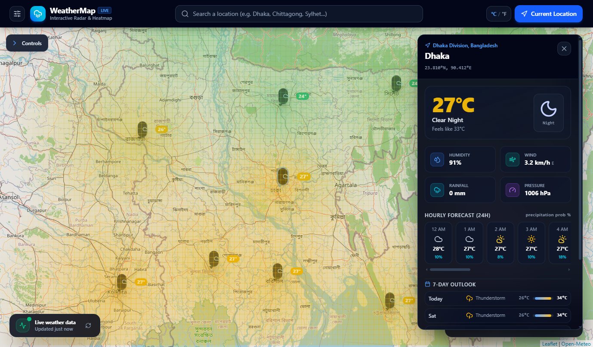

# 🌦️ Interactive Weather Map

  

  

  A simple and professional web application for visualizing real-time weather conditions across multiple locations using an interactive map.

  
  
  

---

## ✨ Features

- 🗺️ Interactive map
- 🌡️ Real-time weather data
- 📍 Multiple location weather markers
- 🎨 Color-based weather visualization
- 🔥 Temperature heatmap / weather overlay
- 🔎 Location search
- 📌 Weather information popups
- 📱 Responsive design
- ⚡ User-friendly interface

---

## 🌍 Weather Visualization

The application represents weather conditions visually using a color-based layer.

**Temperature:**

🔵 Cold → 🟢 Moderate → 🟡 Warm → 🟠 Hot → 🔴 Very Hot

---

## 🛠️ Technologies Used

- ⚛️ React
- 📘 TypeScript
- 🎨 Tailwind CSS
- 🗺️ Leaflet
- 🌍 OpenStreetMap
- 🌦️ Open-Meteo API
- ⚡ Vite

---